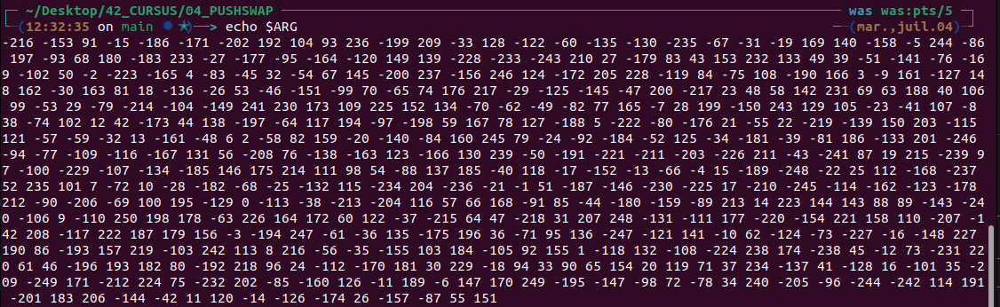

# 04_PUSHSWAP

Description:
> This project aim to deeply understand sorting algorithm. We have to use the lowest possible number of actions. To succeed you'll have to manipulate various types of algorithms and choose the one most appropriate solution for an optmized data sorting.

First, i have calculated the median and if the number is upper than the median, i push to the stack B while i'm decrementing the median. If not, the first number of the stack A go at the end (RA).
Then, i used an array of index to calculate how much it cost to push the first number of the stack b to his right place order in the stack A.


## Run the script

Follow these instructions to see the projet in action. First, clone the repo, open the corresponding folder, and compile the program:

```
git clone https://github.com/waseemnaseeven/42_CURSUS.git
cd 42_CURSUS && cd 04_PUSHSWAP
make
```

Open a terminal and run this ruby command to have a range of 500 random numbers:

```
ARG=`ruby -e "puts (-249..250).to_a.shuffle.join(' ')"`
```

Then:

```
echo $ARG
```



Copy the result of "echo $ARG" and then paste it after the executable + word_count. Expected output is :

```
4369 moves
```
