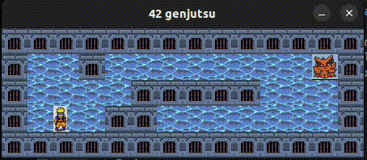

# 05_SOOLOONG

Description:
> This project is a very small 2D game made with the minilibx. It is built to make you work with textures, sprites and tiles.

I improved my skills in the following areas: window management, event handling, colors, textures and so forth.



## Run the script

Follow these instructions to play the game.

```
git clone https://github.com/waseemnaseeven/42_CURSUS.git
cd 42_CURSUS && cd 05_SOOLOONG
make
./so_long maps/basic.ber
```

## How to play

- Move around with WASD
- Collect all objects
- Find the exit
