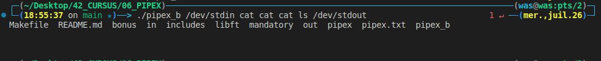

# 06_PIPEX

Description:
> This project aims to deepen my understanding of the two concepts that you already know: Redirections and Pipes. It is an introductory project for the bigger UNIX projects (minishell).

## Run the script

```
git clone https://github.com/waseemnaseeven/42_CURSUS.git
cd 42_CURSUS && cd 06_PIPEX
make bonus
./pipex_b /dev/stdin cat cat cat ls /dev/stdout
```

