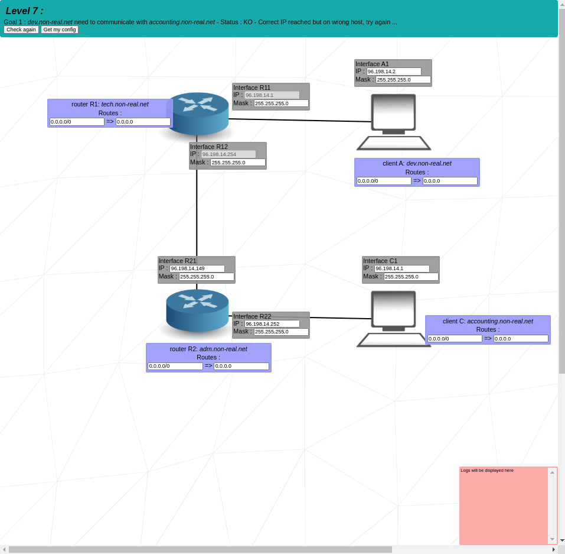

# 13_NETPRACTICE

Description:
> NetPractice is a general practical exercise to discover networking. We have to configure small-scale networks.

Have knowledges in :
	- TCP/IP addressing
	- Mask
	- Calculate addresses in binary
	- Route Table
	- Switch

