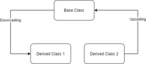

## CPP06

### CASTS

- C-STYLE CONVERSIONS:
	- There are implicit and explicit casts
	- `int a = 42 + double b = a` is possible thanks to implicit conversion. It would be `double b = (double)a` with explicit cast
	- There is a hierarchy among types, dending on precision
	- With some implicit conversions, there can be a loss of precision if the new type has less precision (e.g. double casted to int)
	- It is safer to do explicit conversion when the types are different

- STATIC_CAST
	- is an conversion operator that `convert a type of data`
	- c++ style `implicit conversion` between types, `explicit conversion functions`, `compile-time cast`
	- static_cast can provide both upcasting and downcasting in case of inheritance, but the `parent class` must be accessible, non virtual and unambiguous.
	- it doesnt cast data type pointers during runtime


```cpp
	NouveauType resultat = static_cast<NouveauType>(valeur_a_convertir);
```

```cpp
	int* q = (int*)&c;
	int* p = static_cast<int*>(&c);
```

- DYNAMIC_CAST
	- cast happens at `runtime` and not during compiling
	- Used for `virtual classes`, and so, safe `downcasting`
	- Returns `null` if cast is not possible
	- It possible to cast by pointer `dynamic_cast<Child *>(foo)` or by reference `dynamic_cast<Child &>(foo)`
	- When it's by reference, it can't return a null reference, so there's a specific type of exception: `std:bad_cast &bc`
	- Downcasting : casting a base class pointer to a derived class pointer
	- Upcasting: casting a derived class pointer (or reference) to a base class pointer is known as upcasting



### SERIALIZE

Mecanisme qui converti un objet en sequence de bits qui peut etre stocke en memoire.

En C++, la serialization fait référence au processus de conversion de données ou d'objets en un format qui peut être facilement stocké dans un fichier, transmis sur un réseau ou stocké dans une base de données. La sérialisation permet de prendre des données en mémoire et de les convertir en une séquence de bits qui peuvent être enregistrés ou transférés.

- REINTERPRET_CAST
	- Reinterpretation both in updown and downcast
	- `reinterpret_cast<type>(foo)`
	- It can perform dangerous conversions and force them
	- it doesn’t have any return type. It simply converts the pointer type

reinterpret_cast est un opérateur de conversion en C++ qui permet de réaliser des conversions entre des types de manière très flexible. Il est principalement utilisé pour effectuer des conversions entre des types qui ne sont pas directement liés, par exemple entre un pointeur et un entier, ou pour des conversions plus avancées qui ne sont pas prises en charge par d'autres opérateurs de conversion (comme static_cast ou dynamic_cast).

```cpp
int* ptr = new int(42);
uintptr_t addr = reinterpret_cast<uintptr_t>(ptr);
int* newPtr = reinterpret_cast<int*>(addr);
```
Dans cet exemple, nous convertissons un pointeur int* en un entier non signé uintptr_t, puis nous reconvertissons cet entier en un pointeur int*. Cela peut être utile pour stocker des pointeurs en tant qu'entiers ou effectuer des opérations de bas niveau avec les adresses mémoire.

```cpp
int value = 42;
uint32_t binaryValue = reinterpret_cast<uint32_t&>(value);
```

Ici, nous convertissons une référence à un entier int en un entier sans signe uint32_t, ce qui nous permet de voir la même mémoire sous forme de bits. Cela peut être utile pour effectuer des opérations de bas niveau sur les données.

```cpp
struct A { int x; };
struct B { int y; };

A a;
a.x = 42;
B b = reinterpret_cast<B&>(a);
```

Dans cet exemple, nous convertissons un objet de type A en un objet de type B. Cela est risqué et généralement non recommandé, mais reinterpret_cast permet de forcer cette conversion si nécessaire.

- CONST_CAST
	- It allows to change non-const class members inside a const member function.
	- It can be symptom of bad design


### OTHER THINGS

```cpp
auto a = 42; // auto is a simple way to declare a variable that has a complicated type. For ex: auto is to declare a variable where the initialization expression involves templates, pointers to functions, or pointers to members.

```
