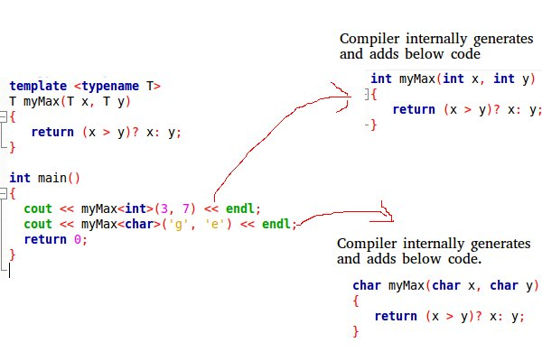

## CPP07

### TEMPLATES

- Les templates en C++ sont une fonctionnalité puissante qui permettent de créer des modèles de classes ou de fonctions paramétrés par un ou plusieurs types. Ils permettent de réutiliser du code en le générant automatiquement pour différents types de données.
- Templates is likes macros, but the difference is that the compiler does type-checking before template expansion.
- The simple idea is to pass the data type as a parameter so that we don’t need to write the same code for different data types.
- C++ declaration of tempaltes allow us to use either class or typename to specify the parameter of the generic model.
- `template` keyword say to the compiler that the thing after will be generic
-



There is :
    - Function Templates
    - Class Templates

- Function Templates:
    - We write a generic function that can be used for different data types. Examples of function templates are sort(), max(), min(), printArray().

```cpp
// C++ Program to implement
// Bubble sort
// using template function
#include <iostream>
using namespace std;

// A template function to implement bubble sort.
// We can use this for any data type that supports
// comparison operator < and swap works for it.
template <class T> void bubbleSort(T a[], int n)
{
    for (int i = 0; i < n - 1; i++)
        for (int j = n - 1; i < j; j--)
            if (a[j] < a[j - 1])
                swap(a[j], a[j - 1]);
}

// Driver Code
int main()
{
    int a[5] = { 10, 50, 30, 40, 20 };
    int n = sizeof(a) / sizeof(a[0]);

    // calls template function
    bubbleSort<int>(a, n);

    cout << " Sorted array : ";
    for (int i = 0; i < n; i++)
        cout << a[i] << " ";
    cout << endl;

    return 0;
}
```

- Class Templates:
    - Class templates like function templates, class templates are useful when a class defines something that is independent of the data type. Can be useful for classes like LinkedList, BinaryTree, Stack, Queue, Array, etc.


```cpp
// C++ Program to implement
// template Array class
#include <iostream>
using namespace std;

template <typename T> class Array {
private:
    T* ptr;
    int size;

public:
    Array(T arr[], int s);
    void print();
};

template <typename T> Array<T>::Array(T arr[], int s)
{
    ptr = new T[s];
    size = s;
    for (int i = 0; i < size; i++)
        ptr[i] = arr[i];
}

template <typename T> void Array<T>::print()
{
    for (int i = 0; i < size; i++)
        cout << " " << *(ptr + i);
    cout << endl;
}

int main()
{
    int arr[5] = { 1, 2, 3, 4, 5 };
    Array<int> a(arr, 5);
    a.print();
    return 0;
}
```

OR, we can pass more data types

```cpp

// C++ Program to implement
// Use of template
#include <iostream>
using namespace std;

template <class T, class U> class A {
    T x;
    U y;

public:
    A() { cout << "Constructor Called" << endl; }
};

int main()
{
    A<char, char> a;
    A<int, double> b;
    return 0;
}
```

### OTHER THINGS

- Use of `sizeof(arr) / sizeof(arr[0])` instead of the writing the real value, to know the real size of an array. Ex:

```cpp
int main()
{
    int a[5] = { 10, 50, 30, 40, 20 };
    int n = sizeof(a) / sizeof(a[0]);
	//int n = 5;

    // calls template function
    bubbleSort<int>(a, n);

    cout << " Sorted array : ";
    for (int i = 0; i < n; i++)
        cout << a[i] << " ";
    cout << endl;

    return 0;
}
```
Cette approche garantit la `portabilite` du code. pcq la taille en octets d'un type de donnees peut varier en fonction de la machine. En utilisant les sizeof on s'assure que notre code fonctionnera correctement quelque soit la taille en octets de `int` sur la plateforme cible.

Cela indique clairement la taille du tableau en divisant la taille totale du tableau par la taille d'un de ses éléments.
