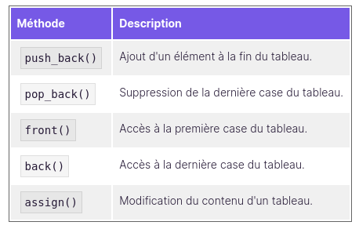

## CPP08

### TEMPLATED CONTAINERS

- `STL` : Standard Template Library, and the basic element is the `vector`
- There is different types of containers :
    - Les conteneurs séquences :  vector  ,  deque  ,  list  ,  stack  ,  queue  ,  priority_queue
    - Les conteneurs associatifs :  set  ,  multiset  ,  map  ,  multimap

- We can use `size()` it return the size of a vector, a list or a map.
- We can use `empty()`, `clear()`, `swap()`



- vector
    - on accède aux éléments via les crochets comme pour les tableaux statiques
    - on ajoute des éléments à la fin via la méthode push_back()

- deque
    - double ended queue, ce qui donne en français, "queue à deux bouts".
    - on peut `push_back()` et `push_front()`

- stack
    - container qui n'autorise l'accès qu'au dernier élément ajouté
	- `push()` ajouter un element
	- `top()` consulter le dernier element ajoute
	- `pop()` supprimer le dernier element ajoute
    - Structure LIFO

- queue
	- container qui n'autorise l'accès qu'au premier élément ajouté
	- `push()` ajouter un element
	- `front()` consulter le dernier element ajoute
	- `pop()` supprimer le dernier element ajoute
    - Structure FIFO

Les tables associatives sont des structures de données qui autorisent l'emploi de n'importe quel type comme index.

On dit qu'une map, par exemple est une table associative permettant de stocker des paires clé-valeur. Vous pouvez donc créer un conteneur où les indices sont des string  , par exemple.


### ITERATORS

- Les itérateurs sont des objets ressemblant aux pointeurs, qui vont nous permettre de parcourir les conteneurs.
- L'intérêt de ces objets est qu'on les utilise de la même manière quel que soit le conteneur ! Pas besoin de faire de distinction entre les vector  , les map ou les list
- On deplace l'iterateur en utilisant les operateurs ++ et --, comme un pointeur
- On accede a l'element pointe via `*`
- `insert()` ajouter un element
- `erase()` supp un element
- `begin()` commencement
- `end()` fin

```cpp
	std::vector<std::string> arr;

	arr.push_back("my homies");
	arr.push_back("my bro");

	arr.insert(arr.begin(), "Yo");

	for (std::vector<std::string>::iterator it = arr.begin(); it!=arr.end(); ++it) {
		std::cout << *it << std::endl;
	}
```

- list
    - comme une liste chainee, dont on peut facilement ajouter des elements au milieu.
	- tres couteux

- map
    - arbres binaires
	- Chaque élément est en réalité constitué d'une clé et d'une valeur. Un itérateur ne peut pointer que sur une seule chose à la fois. Ici, il va pointer sur des `pair` qui sont des objets avec deux attributs publics `first` et `second`
	- `first` = la cle
	- `second` = la valeur

```cpp
	std::map<std::string, double> poids; //Une table qui associe le nom d'un animal à son poids

    //On ajoute les poids de quelques animaux
    poids["souris"] = 0.05;
    poids["tigre"] = 200;
    poids["chat"] = 3;
    poids["elephant"] = 10000;

    //Et on parcourt la table en affichant le nom et le poids
    for(std::map<std::string, double>::iterator it=poids.begin(); it!=poids.end(); ++it)
    {
        std::cout << it->first << " pese " << it->second << " kg." << std::endl;
    }
```

### FONCTEURS

Les foncteurs, quant à eux, sont des objets que l'on utilise comme fonction. Nous allons alors pouvoir appliquer ces fonctions à tous les éléments d'un conteneur, par exemple.

- les predicats sont des foncteurs qui prennent un seul argument et renvoient un booleen.
- On les utilises pour repondre a des questions comme:
	- ce nb est il > 10
	- string contient elle des voyelle ?
	- ce `Personnage` (objet) est il encore vivant ?

ex:
```cpp
class TestVoyelles
{
public:
    bool operator()(string const& chaine) const
    {
        for(int i(0); i<chaine.size(); ++i)
        {
            switch (chaine[i])   //On teste les lettres une à une
            {
                case 'a':        //Si c'est une voyelle
                case 'e':
                case 'i':
                case 'o':
                case 'u':
                case 'y':
                    return true;  //On renvoie 'true'
                default:
                    break;        //Sinon, on continue
            }
        }
        return false;   //Si on arrive là, c'est qu'il n'y avait pas de  voyelle du tout
    }
};
```
Les foncteurs sont des classes qui surchargent l'opérateur ()  . On les utilise comme des fonctions.

### ALGORITHMS

Ici on va decouvrir des algo de la STL qui vont nous permettre:
	- trier un tableau
	- supprimer les doublons
	- inverser une selection
	- chercher, remplacer, supprimer des elements

- algorthm `generate`
-


