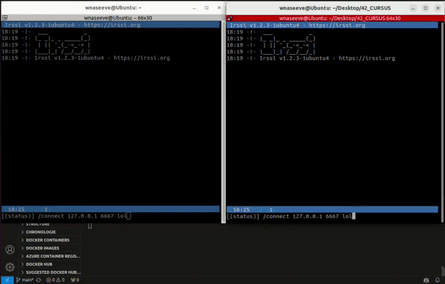

# IRC

Internet Relay Chat Server i create in C++.



## LINUX

### RUN THE PROJECT

```
git clone https://github.com/waseemnaseeven/42_CURSUS.git
cd 42_CURSUS && cd 16_IRC
make
```
then, you'll have to execute the program with a port and a password

`./ircserv 6667 passwd`

### RUN IRSSI CLIENT

If you dont have irssi client on your computer: `sudo apt install irssi`

then, on your terminal: `irssi` and do like the video above.
